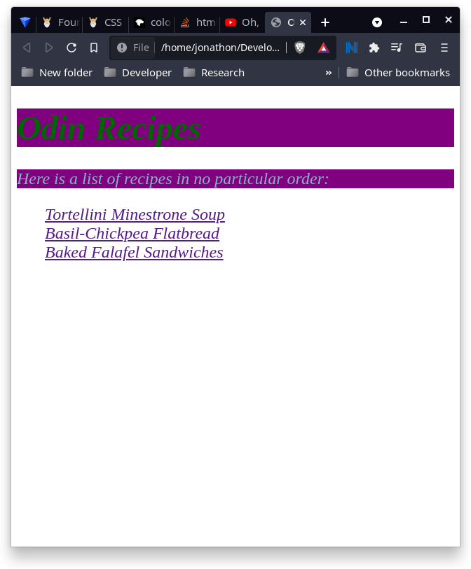

# CSS Foundations
## ***Learning Outcomes:***
- Add styles to HTML with CSS
- Understand how to use the class and ID attributes
- Add styles to specific elements using the correct selectors
- Understand what the cascade does.
## **Practice**
- [x] Go to our CSS exercises repository, read the README, and only do the exercises in the foundations directory in the order they’re colisted, starting with 01-css-methods and ending with 06-cascade-fix.
- [x] 2. Remember the Recipe page you created as practice from the previous lesson? Well, it’s rather plain looking, isn’t it? Let’s fix that by adding some CSS to it!

### CSS Excercises:

## **Knowledge Check**
- [x] **What are the main differences between external, internal, and inline CSS?**
    - The difference is where the CSS script is actually located, which is mostly important for organisation and modularity.
        - **External CSS** files are files with a `.css` extension, which can be linked to inside the `<head>` tag of an HTML document using the `<link>` tag: `<link rel="stylesheet" src="style.css">`. For most purposes, this is the best option.
        -  **Internal CSS** is located in the HTML document inside a `<script>` tag located inside the `<head>`. This is not recommended because it causes unnecesary bloat inside the HTML file and makes things tightly coupled.
        - **Inline CSS** is also located in the HTML document, except it's written inside an individual element's `style` attribute in the opening tag eg. `<h1 style="font-size: 18px; color: blue;">`. This usually just makes things complicated and hard to maintain, so it's rarely used outside of some specific purposes.
- [x] **What is the syntax for class and ID selectors?**
```css
.class-selector{}
#id-selector{}
```
- [x] **How would you apply a single rule to two different selectors?**
by using multiple selectors seperated by commas:
```css
    h1,h2 {
        /* css rules here */
    } 
```
- [ ] **Given an element that has an id of title and a class of primary, how would you use both attributes for a single rule?**
```css
    #title, .primary {
        /* css rule here */
    }
```
That could be wrong actually. It might instead be:
```css
    #title.primary {
        /* css rule here */
    }
```
- [x] **[!]task:** test both of those and see which is correct.
- **[!]result:** adding this style to the css works:
```css
    #my-id, .my-class {
    background-color: purple;
}
```
For this to work, I added a class and id to these elements in index.html: 
```html
    <h1 class="my-class">Odin Recipes</h1>
    <p id="my-id">Here is a list of recipes in no particular order:</p>
    
```
**Screenshot:**

- [x] **What does the descendant combinator do?**
    - It allows more specific selection of elements nested at any level inside of a parent/ancestor element. The correct syntax is to seperate each selector with a space, starting with the parent element and moving down hierarchically to any level. 
- [x] **Between a rule that uses one class selector and a rule that uses three type selectors, which rule has the higher specificity?** 
- The Specificity Hierarchy is as follows, from most to least specific:
    1. **Inline styles** eg. `<h1 style="color: blue;">`
    2. **IDs** eg. `#da-ba-dee-da-ba-di`
    3. **Classes, pseudo-classes, attribute selectors** eg. 
    ```css
        .test {}
        :hover {}
        [href] {}
    ```
    4. **Elements and pseudo-elements** eg.
    ```css
        h1 {}
        :before {}
    ```
- Therefore, the answer is that the class is more specific than the element type.